# Assignment 3

**Name:** Ilya Koval

**Group:** SE-2539

## Part 1. Media Queries

### Task 0. Responsive Typography

**Desktop**

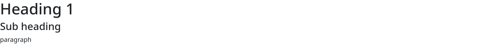

**Tablet**

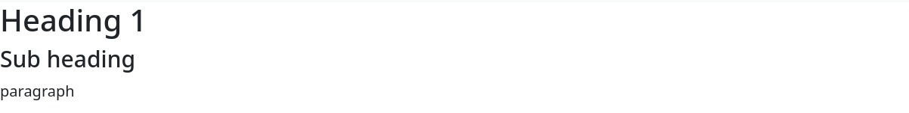

**Mobile**

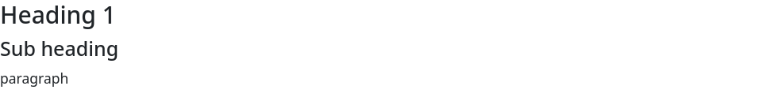

The page presents a heading 'Heading 1', a subheading 'Sub heading' and a paragraph. Media queries alter the font size depending on the screen size. The heading 'h1' changes its font size from 24px on mobile, to 32px on tablet and 48px on desktop. The subheading 'h2' changes from 20px to 24px and 32px. As for the paragraph, it grows from 14px to 16px and 20px. On screenshots, I can see that text becomes smaller on smaller screens.

### Task 1. Responsive Layout with Media Queries

**Desktop**

**Tablet**

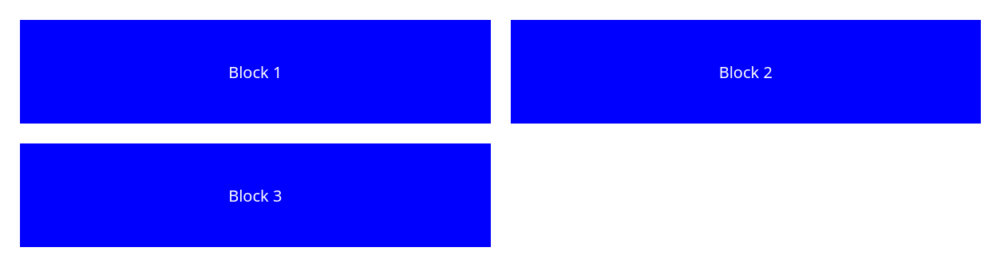

**Mobile**

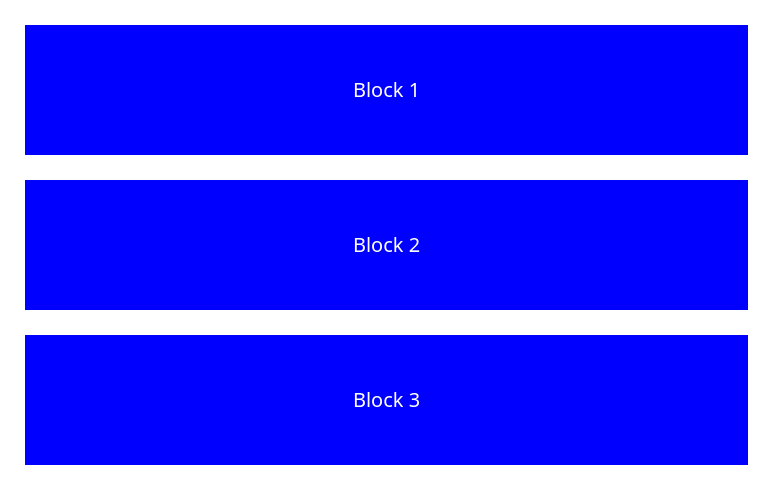

The page presents three blue blocks: Block 1, Block 2 and Block 3. It uses CSS Grid and custom media queries (not Bootstrap). On desktop, the three blocks appear on the same line. On tablet, the layout changes and the Block 3 moves to the new line. On mobile, all blocks are stacked vertically.

## Part 2. Bootstrap Grid System

### Task 2. Bootstrap Responsive Columns

**Desktop**

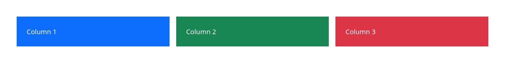

**Tablet**

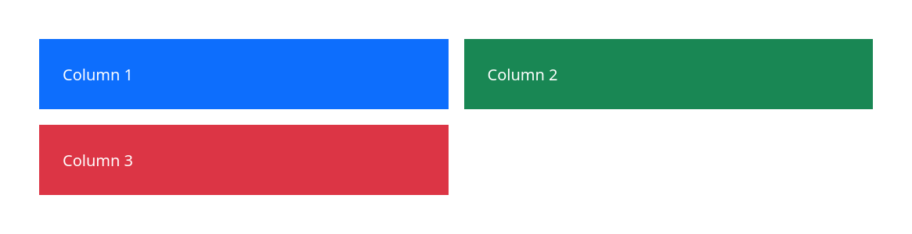

**Mobile**

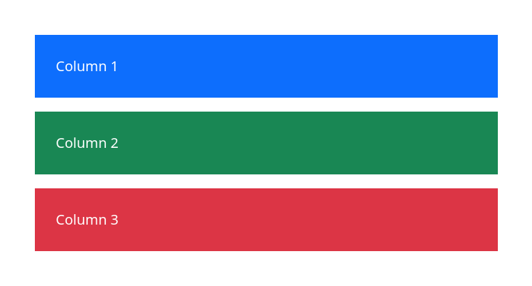

The layout uses the Bootstrap responsive grid system. It presents three colored columns: blue, green and red. They have the classes 'col-12', 'col-md-6' and 'col-lg-4'. On desktop, each column occupies 4 out of 12 columns, which fits three columns per row. On tablet, each column occupies 6 out of 12 columns, which fits two columns per row. On mobile, each column occupies the entire width of 12 out of 12 columns. On small screens, all three columns are stacked vertically. The third column moves to a new line on tablets.

### Task 3. Bootstrap Navigation Bar

# Desktop
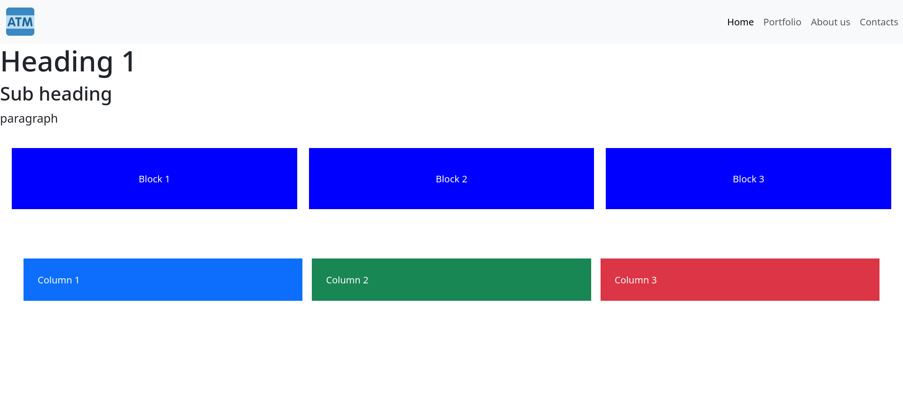

# Tablet
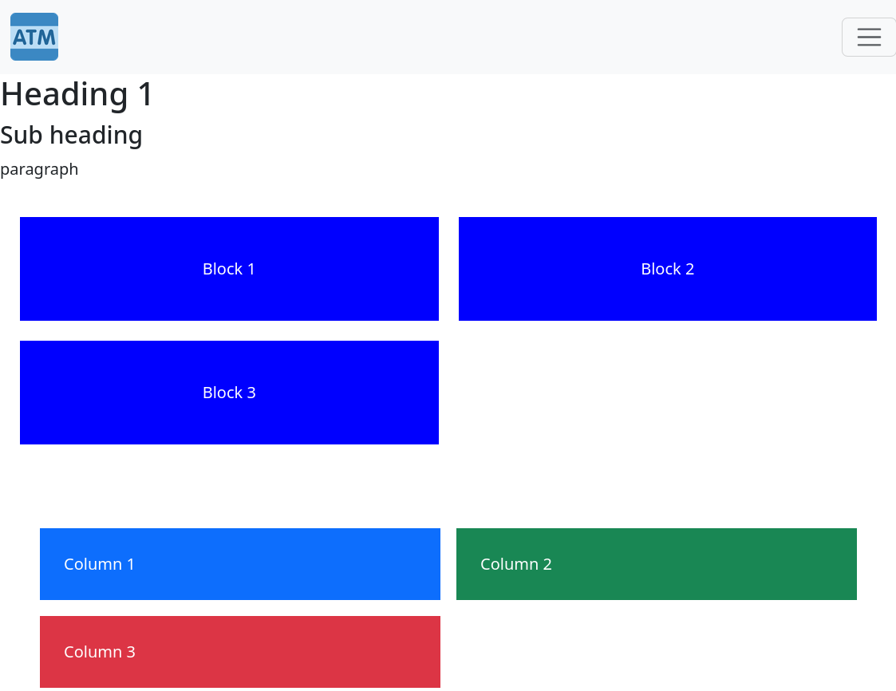

# Mobile
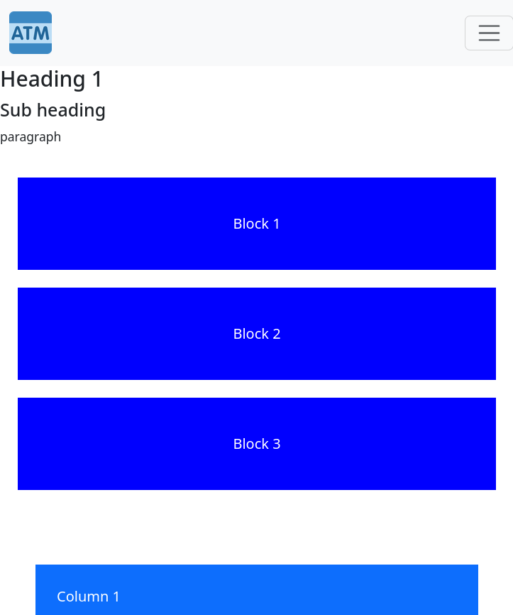

The navigation bar is built with Bootstrap components. It has a light background. The logo is represented with the ATM icon on the left. The links Home, Portfolio, About us and Contacts are located on the right. The Portfolio link leads to the portfolio page (Task 4). On small screens, the links are hidden behind the Hamburger button. Clicking it opens the navigation menu.

## Part 3. Combined Project

### Task 4. Responsive Portfolio Page

**Top of the Page**

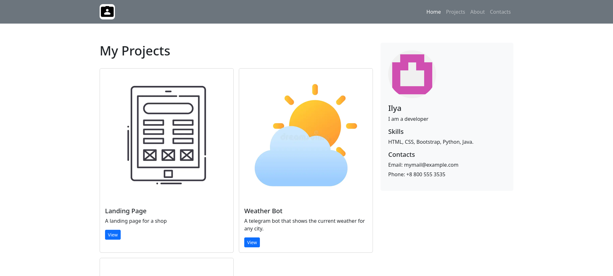

**Bottom of the Page**

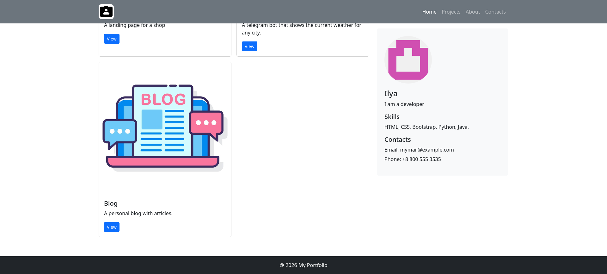

# Tablet
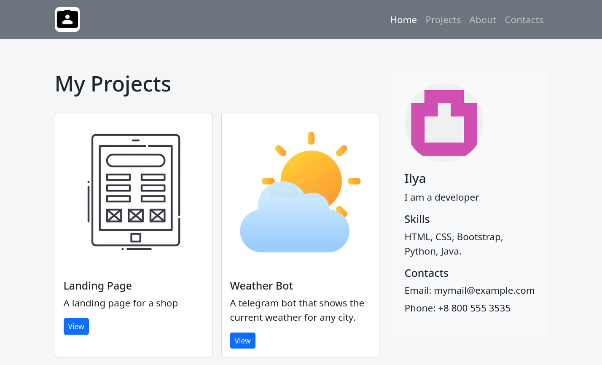

# Mobile
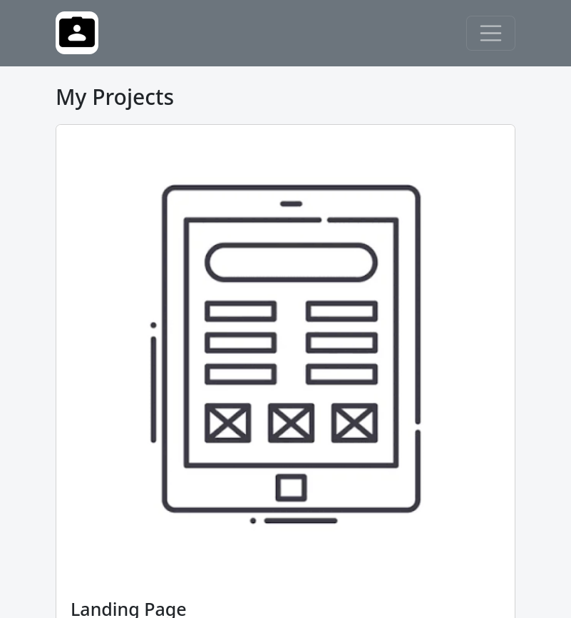

The portfolio page is developed with the Bootstrap grid and customized by media queries. The page contains a fixed gray navbar, the main section, and a footer. In the left part of the page, there are three cards – Landing Page, Weather Bot, and Blog. To the right is the Sidebar with personal info, skills, and contacts. On the mobile view, the navigation bar changes to the hamburger menu and all elements are placed in a column. The font size and spacing between sections are also customized with media queries.

## Summary

Firstly, I created a responsive typography and a responsive grid of boxes using only CSS and media queries. Further, with the help of the Bootstrap framework, I build a responsive column layout and a responsive navigation bar with a hamburger menu. Moreover, I combined both versions (pure CSS and Bootstrap) and made a portfolio page. All versions were checked and opened in the browsers’ developer mode with different width settings.
